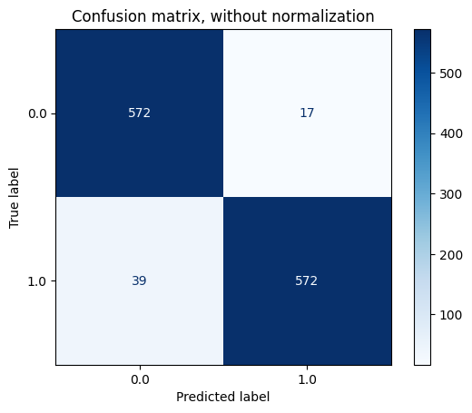

# Convolutional-Filter-with-Genetic-Programming
**Implementation of a Convolutional Filter with Genetic Programming**

The objective is to use genetic programming to find a convolutional filter, if one exists, capable of producing an output (signal) that can be classified in a better way than the original signal classified by a fixed classifier. The Random Forest classifier was chosen for this comparison. The project involved finding a filter through genetic programming that transforms the input signal into another signal by convolution. The aim is then to find a kernel that is able to transform the signals in the data set in such a way that the result of the subsequent classification with Random Forest is better than the result obtained on the untransformed data. The evaluation metric used is the F1 score.
In general, the project was implemented in Python with the support of several libraries. The sklearn library was used to use the random forest classifier and to calculate all the metrics needed for the comparison. Instead, the DEAP library was used to implement the genetic programming algorithm.

## The dataset 
The signal used for the project is a temporal signal that concerns electrocardiograms or ECGs. In the project, the dataset used was composed by a *.csv file* in which each line regards a specific EGC signal, thus the dataset contains signals relating to individual heart beats. In particular, an ECG is a diagnostic examination that records the electrical activity of the heart in order to assess its state of health and detect various cardiac anomalies, pathologies or arrhythmias. The dataset cannot be published due to privacy concerns. In order to achieve a fixed length for all length for all selected parts, these were filled with zeros. In the *.csv file* the dataset is composed by some columns, in which the first column contains the class label and the remaining columns represent the length of the signal, filled with zeros to obtain a fixed length.

The complete dataset is characterised by 6000 elements, initially labelled in two classes:
- **Normal**: label 0.0. These signals refer to normal electrocardiograms, i.e. without any cardiac abnormality, pathology or arrhythmia. 

    


- **Abnormal**: label 1.0. These signal abnormal electrocardiograms, therefore characterised by the presence of possible cardiac abnormalities, pathologies or arrhythmias. 

    

## Random Forest Classificator
To assess the quality of the genetic programming algorithm, a comparison is made with a **Random Forest classifier**. In order to eliminate the random component of this classifier, a *seed_state = 1200* was chosen at the beginning, which was then used in each Random Forest of the project. The dataset was split into a train-set and a test-set. Then, the Random Forest classifier was trained on the train-set and the performances was evaluated on the test-set. In detail, this classifier achieved an *F1 score* of 0.9534 on the 6000-item dataset.

<div style="display: flex;">
      
    
</div>

## Genetic Programming Algorithm
Genetic programming was used to find the best convolutional filter and to see if it could outperform the Random Forest classifier.
In genetic programming, each individual resulting from evolution can be seen as a function that takes a set of input parameters and produces an output.
In this case, the aim was to have a genetic programme that could generate individuals with a number of input parameters equal to the size of the kernel and produce a single value as an output. In general, therefore, the starting point was to find the optimal kernel size, which is characterised by the variable *KERNEL_SIZE*. After a few trials, it turned out that the best kernel size for convolution on this signal was one of size = 6, followed by one of size = 7.

As far as the creation of the Genetic Programming algorithm is concerned, the first crucial step is to initialise the **set of primitives**. Each primitive in the set is characterised by an associated function, which is called when the corresponding node is evaluated, and a specific cardinality, i.e. the number of parameters it accepts as input. Furthermore, the functions generated by the set of primitives require a number of arguments equal to *KERNEL_SIZE* in order to be evaluated correctly.

```shell
    pset = gp.PrimitiveSet("MAIN ", KERNEL_SIZE)
    pset.addPrimitive(operator.add, 2)
    pset.addPrimitive(operator.sub, 2)
    pset.addPrimitive(operator.neg, 1)
    pset.addPrimitive(operator.mul, 2)
    pset.addPrimitive(protectedDiv, 2)
```

Having defined the set of primitives, it was then necessary to define the **toolbox**, which provides a set of methods for capturing and defining the basic operations of the Genetic Programming algorithm. Moreover, is important to define the function used to individual evaluation:

```shell
def evaluate_fitness(individual):
    fitness , rf = fitness_function(individual)
    return fitness ,
toolbox.register("evaluate ", evaluate_fitness)
```

To evaluate the goodness of the algorithm, it was necessary to divide the training set, which is also used for the Random Forest classifier, into a *training set* and a *validation set*. In the case of the evaluation function, the process starts by taking as input the individual to be evaluated, which represents a possible solution to the problem. This individual is compiled to obtain the function and then used to generate, via convolution, a new train set, which is used to train the Random Forest classifier model, and a new validation set, on which the trained model is then evaluated.

The main operation performed by the algorithm concerns **convolution**, necessary to obtain new sets of signals. The convolution is applied for each row of the train-set and the validation-set, using the function *apply_convolution_to_row()*:

```shell
def apply_convolution_to_row(row , func):
    num_windows = len(row) - KERNEL_SIZE + 1
    result = []
    for i in range(num_windows):
        window = row[i:i + KERNEL_SIZE]
        value = func(*window)
        result.append(value)
    return result
```

The test phase was carried out on the test set in order to evaluate the performance of the algorithm, and in this case of the best kernel found, on data that had never been seen before. In fact, once the best individual had been selected, it was necessary to apply the convolution also to the test set. To access the best individual and kernel found by the genetic programming algorithm, DEAP's *HallOfFame* was used, which keeps track of the best solutions found during evolution.

```shell
hof = tools.HallOfFame(1)
best_individual = hof[0]
best_fitness , best_rf = fitness_function(best_individual)
best_kernel_function = gp.compile(gp.PrimitiveTree(best_individual), pset)
```

Thus, the best results based on the F1 score and therefore the fitness of the best individual were found with a kernel size of 7. In fact, with the dimension 6 kernel, the final F1 score was 0.9668, while with the dimension 7 kernel it was 0.9696. 

<div style="display: flex;">
    
    
</div>

In both cases there is an improvement over the original Random Forest classifier. 

More details and some examples are reported in the *Report.pdf file*.
